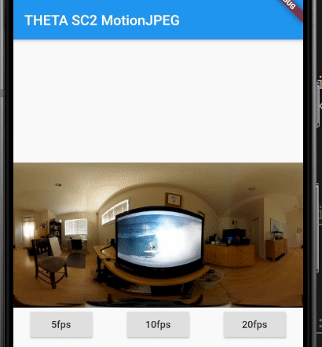

# RICOH THETA SC2 MotionJPEG LivePreview

Viewer for motionJPEG stream from RICOH THETA SC2

Tested with firmware 1.31


## Landscape Mode 


MotionJPEG demo on Android AVD displaying video on laptop to show how the app can display motion.  
Imagine you have the THETA SC2 out capturing a real surf scene instead of a simulated
session on a laptop.

## Portrait Mode



Portrait mode adds buttons to change the fps for testing.
Elapsed time since the start of the MotionJPEG test session is
also displayed.

## ToDo

- Rewrite app to isolate updating of stateful widgets, which may improve updating. Though, it seems
to work great now with the gaplessPlayback and precacheImage implementation
- change fps button color when selected.
- figure out why app only works on SC2 and not on V/Z1.  The http request doesn't return
the same result on V/Z1. For the V/Z1, I built a different app
using the dart:io HttpClient() instead of the 
http package.


## Tips for Smooth Playback

### gaplessPlayback

Implemented 
[gaplessPlayback](https://api.flutter.dev/flutter/widgets/Image/gaplessPlayback.html) property.

### precacheImage

I used [precacheImage](https://api.flutter.dev/flutter/widgets/precacheImage.html) to eliminate a white flickering problem.  
I'm not sure when the cache is cleared or if the physical 
device will run out of memory.  I've tested it for continous streaming for 10 minutes.


```dart
Image cachedImage = Image.memory(
  Uint8List.fromList(
    buf.sublist(73, buf.length),
  ),
);
precacheImage(cachedImage.image, context);
setState(() {
  frameImage = cachedImage;
});
```

## More Information

[RICOH THETA SC2 Developer Community Site](https://theta360.guide/special/sc2/)